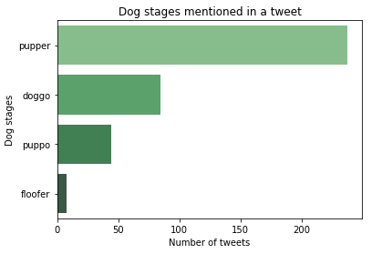
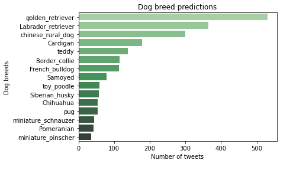
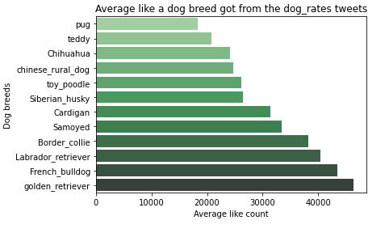
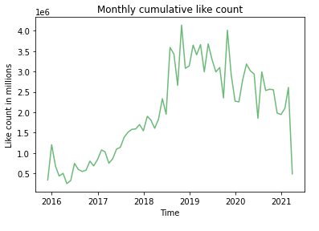
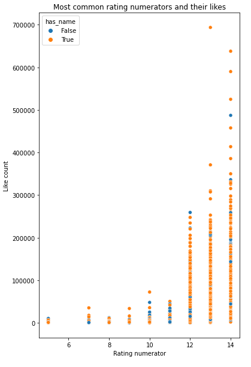
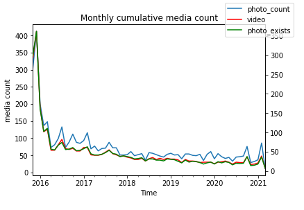
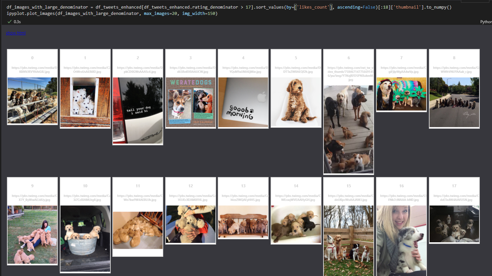
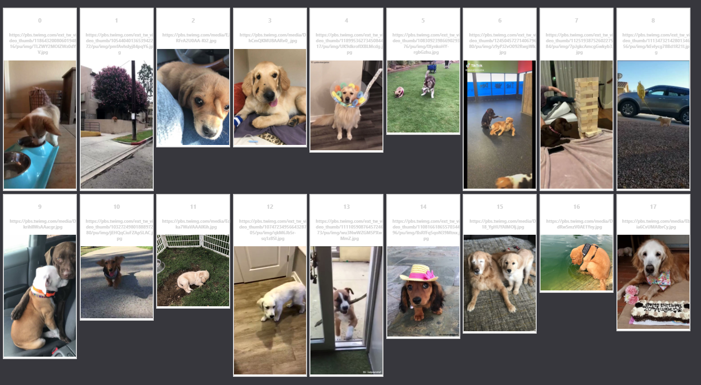

# Data Analysis and Insights

This project focuses on data wrangling and analysis on pre-gathered datasets of a Twitter user @dog_rates.

## Insights

### 1) which dog stages mentioned in the tweet the most

- small dogs mentioned the most

### 2) what are the highest dog breed predictions

- retriever types posted the most

### 3) If we want to get most like which dog breed should we choose

- golden retriever and french bulldog liked the most.

### 4) how the monthly number of likes changed over time. when @dog_rates was in its prime

- in 2019 @dog_rates received the most interaction from the community

### 5) How much does the high rating received from @dog_rates liked by the community

- most liked tweets have a high numerator rating and have a dog with a name in the tweet.
- there doesn't seem to be a high correlation between dog_rates' rating and the amount of like a tweet gets.

### 6) Does the channel share more videos instead of images as time passes

- there can only be one video in a tweet
- there could be multiple images in one tweet
- if we look at the tweets with an image or a video, (green and red lines) they are quite similar.
- when the green and blue lines have distance between them, those are the months with multiple images in one tweet. if the distance is as high as the green line, that means on average there are two images in one tweet. however, looking at the chart we can see there isn't a month that has more than ~1.5 images per tweet

### 7) Why some of the denominators are too large

- looking at the images with denominators larger than 17
- it seems denomination calculated as -> number of dogs * 10
- the more dogs a picture has the more denomination

### 8) What are the images of the most liked tweets 

- most of them are videos
- these are the thumbnails of those videos
- top one has 693747 likes, the second one has 637945

### 9) What are the most liked image only tweets

- same images appear here as well.
- video column on the detail page might not work as intendent.