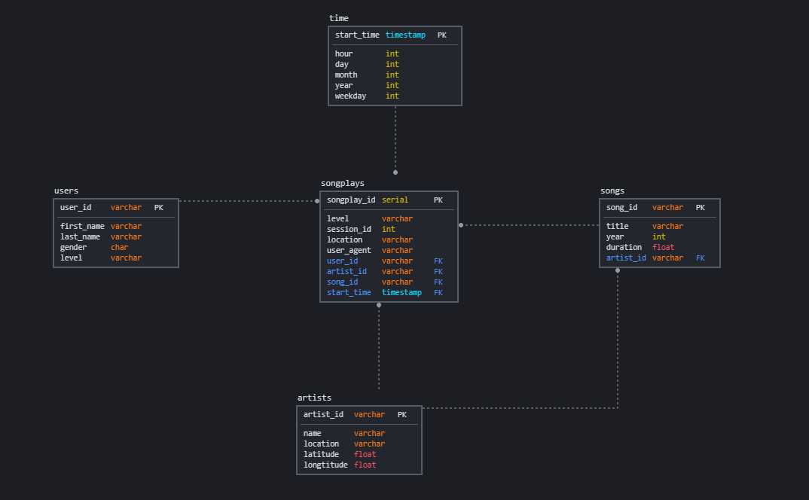

# Sparkify ELT pipeline

## Objective

- design database tables optimized for song play analysis
- create ETL pipeline for this analysis

## Project Files

`create_tables.py` uses queries defined in `sql_queries.py` to create the database and tables on that database.

`sql_queries.py` has instructions to create, insert and drop the tables of this project. table schema design illustrated below

`etl.py` uses given datatsets (`song_data` and `log_data` inside the data folder) extracts the information from these files, transforms it according to our needs and loads it to the database

## Running the Project

- project requires a local postgresql db with given cretentials in `etl.py`
- first `python create_tables.py` is executed to create the db
- second `python elt.py` is executed to process and load the data into this database

## Database Schema



- sqldbm.com is used to create this db design.
- we have one fact table `songplays` with 4 foreign keys to 4 dimension tables
- this is a star schema

## Database Files

- data files are inside data folder
- there are in json format

Song dataset example

```
{
   "num_songs":1,
   "artist_id":"ARJIE2Y1187B994AB7",
   "artist_latitude":null,
   "artist_longitude":null,
   "artist_location":"",
   "artist_name":"Line Renaud",
   "song_id":"SOUPIRU12A6D4FA1E1",
   "title":"Der Kleine Dompfaff",
   "duration":152.92036,
   "year":0
}
```

Log dataset example

```
{
   "artist":null,
   "auth":"Logged In",
   "firstName":"Walter",
   "gender":"M",
   "itemInSession":0,
   "lastName":"Frye",
   "length":null,
   "level":"free",
   "location":"San Francisco-Oakland-Hayward, CA",
   "method":"GET",
   "page":"Home",
   "registration":1540919166796.0,
   "sessionId":38,
   "song":null,
   "status":200,
   "ts":1541105830796,
   "userAgent":"\"Mozilla\/5.0 (Macintosh; Intel Mac OS X 10_9_4) AppleWebKit\/537.36 (KHTML, like Gecko) Chrome\/36.0.1985.143 Safari\/537.36\"",
   "userId":"39"
}
```

## ETL pipeline

- details about the pipeline can be found in `elt.py`