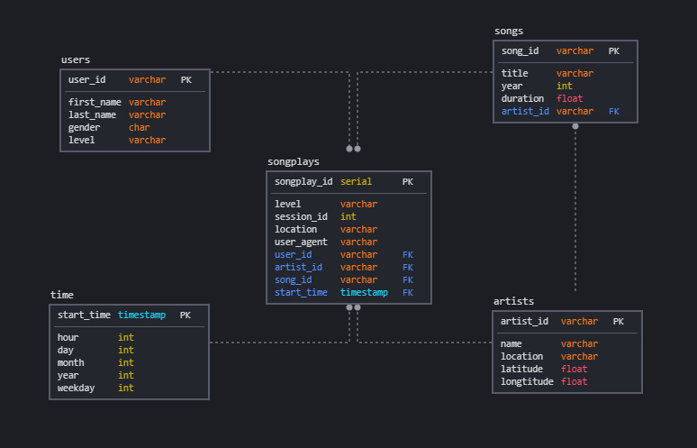
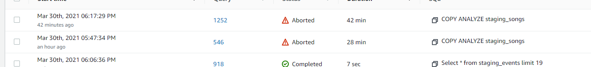
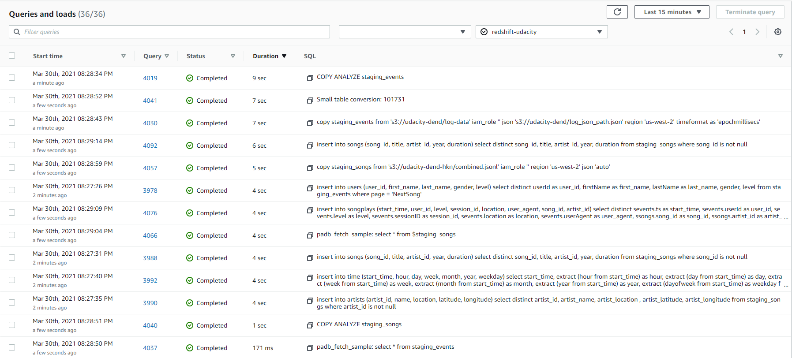

# AWS Redshift Data Warehouse

## Project structure

- `/docs` has the notes and tasks
- `/images` provides images in the readme
- `/local` localstack configuration files and notes
- `/scripts` various scripts and notebooks for testing and IaC deployment of AWS configuration
- `/src` codebase
  - `/src/db/create_tables.py` used to create tables in AWS redshift
  - `/src/pipe/etl.py` ETL process to load data from S3 transform and send to redshift
  - `/src/util/sql_queries.py` includes the SQL queries used in the files above 

## Database Schema

Created a star schema optimized for queries on song play analysis.

- denormalized DB is better for data analysis 
    - better query performance (less and clear joins, smaller tables)
    - simple queries, easier to understand, apply and follow 
- 1 fact table and 4 dimensions make it easier for data analysts to work on.
  - sparkify data analysts could use this scheme to analyze user behavior in songplays fact table and filter and create complex queries using the dimension tables. 
  - 
- distribution strategies
    - dedicated to distributing users to all nodes. currently, the user table is small and the cost of distributing small tables during query is not significant. but as the user base grows it might be beneficial to have this table on many nodes.

## ELT process

- log and song data provided in s3 buckets from udacity
- using the scripts inside the `sql_queries.py` 
  - redshift worker copies data from s3 using `iam_role`
  - while songs data copied to staging table as is, timestamp property of events table formatted as it is copied

### Copy problem

- copying staging files took more time than I thought. it might be because;
  - data inside the songs bucket divided into too many folders
  - in my setup s3 and redshift are in different regions
  - might be a problem with the ELT code

- when the copy process took more time than 40 mins I decided to copy the bucket to my account in the same region but it didn't help. later I used a portion of the data using the top directory as the source `s3://udacity-dend-hkn/song_data/A/A/`
- However, this approach resulted in little data for the analytical process. So I combined all the json files in one jsonlines file and used it as the data source. this improved the feedback loop a lot and debugging become easier.
  

- this entire creation and pipeline process took around a minute

row counts:  
staging_songs -> 14896  
artists -> 10025  
songplays -> 333  
time -> 333  
users -> 104  
artists -> 10025  
songs -> 14896  
staging_events -> 8056  

in the process of transforming (selecting 'NextSong' as page, distinct rows, having only non-null columns and relations between tables) I filtered out most of the songplays and time data generated from it.

## LocalStack

- I decided to use this project as a way to getting familiar with localstack
- after configuring awscli, docker and localstack cli it worked without a problem
- to explore the setup I found a trial program called commandeer. configuring docker network to work with commandeer took some time but it was worth it. the interface for iam and s3 is nice.
- the downside is there isn't much on redshift in the trial version (or I couldn't get it to work as I expected it to) after this point I had a working environment but to complete the project decided to continue with aws

# References
- [distribution strategy](https://docs.aws.amazon.com/redshift/latest/dg/c_choosing_dist_sort.html)