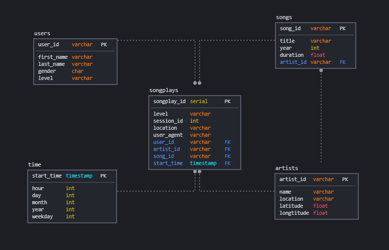
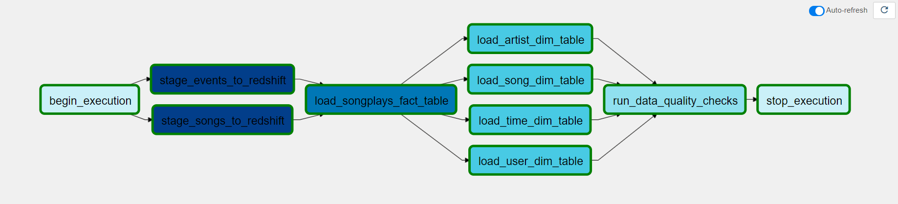
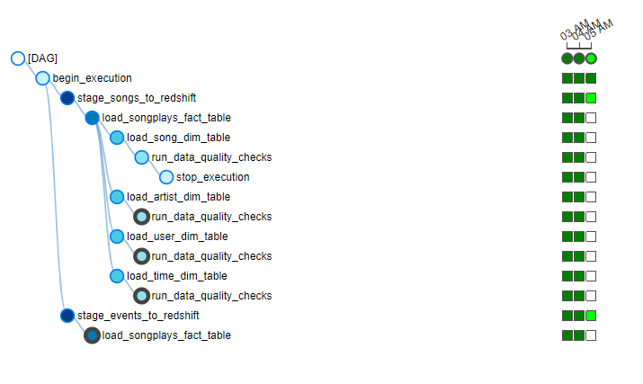
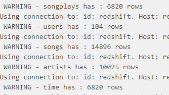
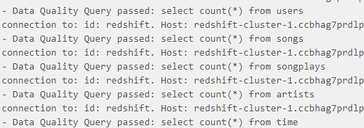

# Airflow Data Pipelines Project

Sparkify wanted to automate ETL process and decided to use airflow.
This project creates a dag and plugins for
    - receving data from s3
    - staging the data into tables in redshift
    - from redshift creating star schema with 1 fact 4 dimension tables
    - and finally checking quality of the created tables 

## Project structure

- `/docs` has the commands for deployment and installation
- `/images` provides images for the readme
- `/scripts` scripts used for testing
- `/docker` has project code and the docker-compose file for airflow 
- `/docker/dags/airflow_dag.py` is the file all the tasks in the dag defined and ordered.
- `/docker/plugins/operators` contains custom plugins for ETL tasks
- `/docker/plugins/helpers` contains sql queries

## Database Schema

Database schema is given with the project template

- denormalized DB is better for data analysis. 
    - better query performance (less and clear joins, smaller tables)
    - simple queries, easier to understand, apply and follow 
- 1 fact table and 4 dimensions make it easier for data analysts to work on.

## Configuration

- Project depends on aws_credentials and redshift configuration which defined in airflow

## Results

### Graph

- This is the resulting graph
- is_debug switch drops and creates tables if needed
- stage events and songs run in parallel
- after fact table is created, dimension tables run in parallel
- dag finishes with quality checks

### Execution

- code is run each hour
- doesn't have dependency on the past runs
- on fail tasks are retried 3 times
- retry interval is 5 minutes
- catchup is disabled
- doesn't email on retry

### Quality checks  

- quality check plugin prints the rows it found in the logs

- updated version checks null and count queries defined inside the DAG

## Changes to provided files

- To make debug process faster I combined provided json files into one big jsonl file and uploaded it to a s3 bucket.
- moved the provided files inside de docker folder. some of the classes were not visible for the docker setup, so I changed some of the `__init__.py` files

## Update
- DAG dependency graph updated
    - two new operators created Load dimension and load fact
    - debug nodes removed
- Quality checks updated. queries to check passed as list input with a comparison operator
- in redshift operator support for CSV added