# Introduction

For the capstone project, I decided to define the scope and data for myself instead of using provided datasets.

As detailed in this [exploration](./docs/0_exploration.md) document, I was looking for a dataset that I could work on other nanodegree courses as well (NLP and Data Scientist).

There are a wast amount of data available for popular languages, but in my native language, there aren't many raw text data available that I can use for personality analysis other than social media. (Which I already am working on with twint library, so I was looking for an alternative data source)

There is a website called [---](https://----.com/) which is like a text-only version of [reddit](https://www.reddit.com/r/all). This site is quite popular in Turkey.

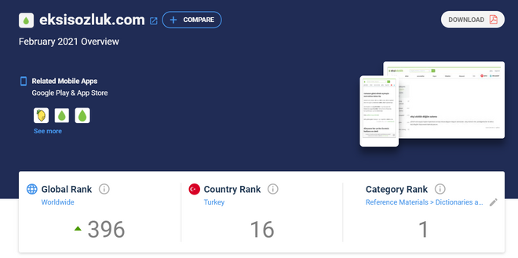

Most of the visitors are from Turkey as well

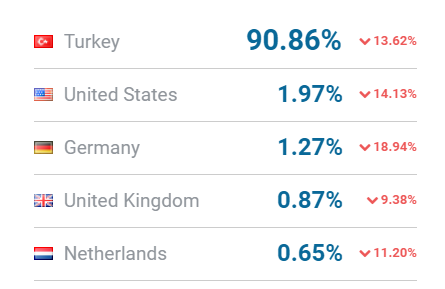

Although the site is publicly visible (doesn't require login) its data is not available for download. Since it is public scraping is possible and if not done in a disrupting manner and not processed to create competition for the site it is legal. So I started with data gathering.

# Roadmap

The roadmap and all the tasks I completed and not completed are listed in [this](docs/1_roadmap.md) document.

It also includes references to scripts and other parts of the project

# Data gathering

Almost all of the crawling done in a separate environment from this project. A subset of the data gathering scripts is imported inside `/apis/eksi/` folder which I am using for periodical data gathering to get recently added posts.

Some of the preprocessing and data filterings are done while collecting the data. However, since this collection process was iterative some of the data models expanded (new columns) and this created not-so-clean raw data at the end. These problems are addressed in the transformation stage of the data in the pipeline.

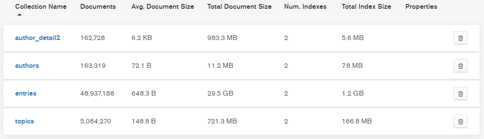

This is the resulting raw dataset. I used MongoDB while saving raw data.
Data came from 3 different APIs and from manual crawling (using scrapy)

- There are 5 million topics (like Reddit posts)
- ~50 million entries (like Reddit comments)
- 160k authors (name and id)
- and details of these authors (their account page and their favorited entries)

The data-gathering stage took more than I would like to admit. There were also programming errors that took me back almost a week.

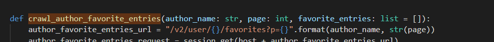

For example, this method takes a favorite_entries list as the last parameter. What I expected was, if an array passed as the last argument use it and if not initialize a new array. It was actually keeping the previous data and expanding it. While I wasn't looking in 3 days I had a database with 300GB of repeated data in it.

Before changing the data structure I played around with the data using PowerBI. I applied some transformations to get a feel how should I change the data model

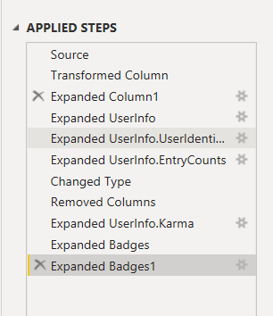

Example of a calculation I wanted to do after ETL. Number of authors by year

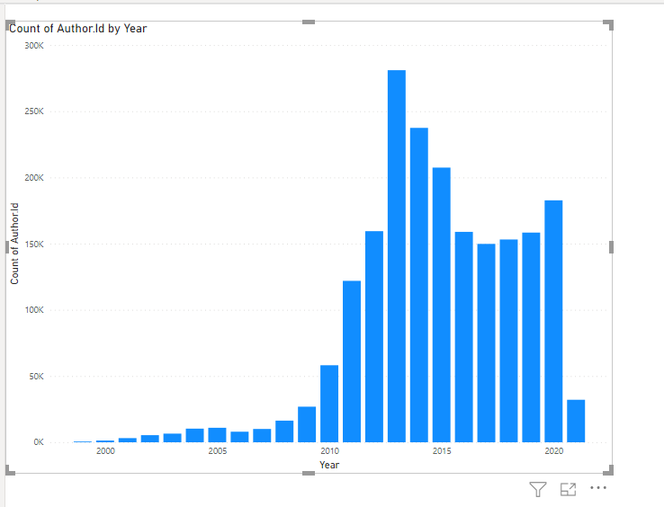

Although I didn't have time to integrate, I also gathered some external data.
- historical usd-try currency data (from investing.com) (often talked in the form)
- historical football score data (from [here](http://www.football-data.co.uk/))
- some nlp related data (local person, city, street, organization names)

# Prepared data

I will be preparing the data for analysis. 
Specifically to make a personality analysis depending on 
- Authors Post
- Topic of their post
- Other favorite posts
- Their most favorited and controversial posts
- Myers–Briggs Type Indicator (there is a topic people post their types)
- Separating topic into categories (politic, sport, etc..)

# Data Exploration

Unfortunately, most of the data columns (~%60) could be null. Identifying values (name/id/date) exists in all 3 staging tables. I will be taking them and keeping null values until the main focus of my analysis is defined.

### Anomalies
- When an AMA (ask me anything) occurs, the schema of the topic and entries changes. They could become nested. 
- Users could be banned, their accounts could be deleted but their entries remain.
- In the middle of data gathering I realized I could get the topic creation data and 2 more info about it. Since parsing 3M topics again was going to take time I decided to keep existing rows but have empty columns in the old rows.
- This also happened while parsing authors. There, with 1 more page crawling, I was able to get the author's most favorite entries. This column also has missing values due to this adjustment

## Data Model

I decided to use entries (posts) as the fact table. Entries are the things that define this website. They have the most related to other models
- authors make posts
- topics have posts
- users interact with posts (like share)
- NLP will mostly focus on posts (second titles, third users)

Therefore I decided on star database schema

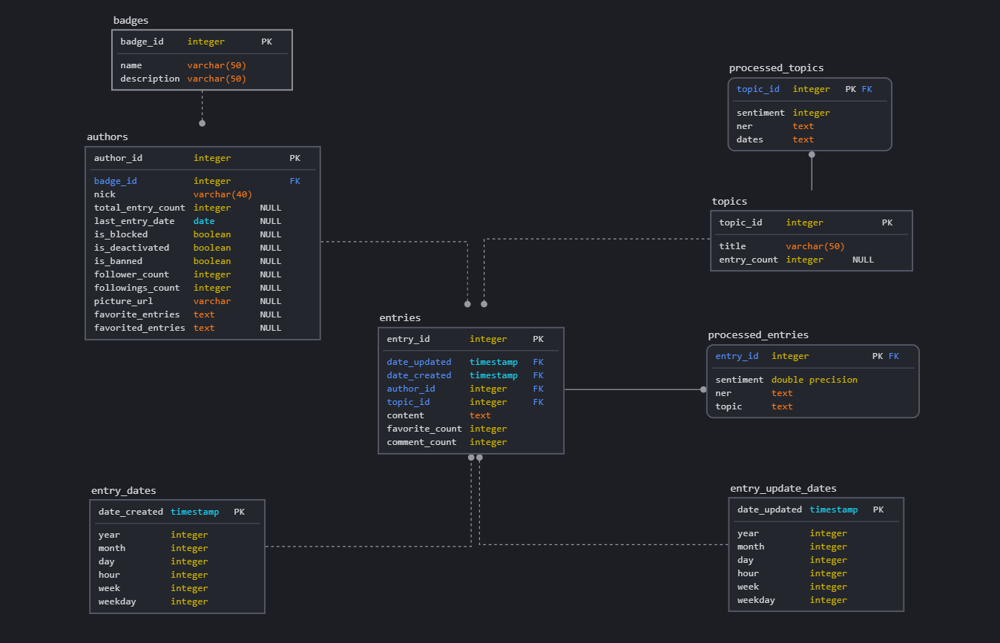

In the future when entries and topics are processed by NLP pipelines they will have 1 more table attached to them. For the final personality analysis, I will be using these processed_ tables and joining with other tables to group similar authors.

While this design worked well for the local Postgresql database, I needed to drop a column when the data is moved to redshift. Redshift doesn't support text longer than 64K chars. This makes sense because relational databases are not the place to hold large texts. So the content in the entries table is removed. Since the data is large (33gb and counting) I used a small portion of it and will move it to a NoSQL database (like I did in the raw format) and link these two databases.

# ETL 

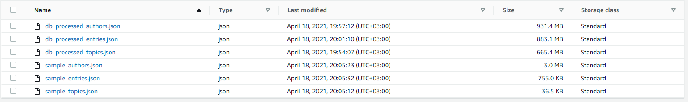

- Raw data first uploaded to s3
- Databases created using the file `/scripts/6_redshift/all_sql_queries.py`
- Then airflow scripts run to execute the ETL pipeline

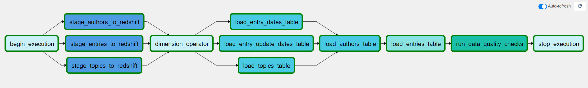

- pipeline first loads the data into redshift
- then independent 3 dimension tables are loaded
- then authors and finally entries (fact table) inserted
- quality checks run on all tables to make sure they are not empty and doesn't contain null values

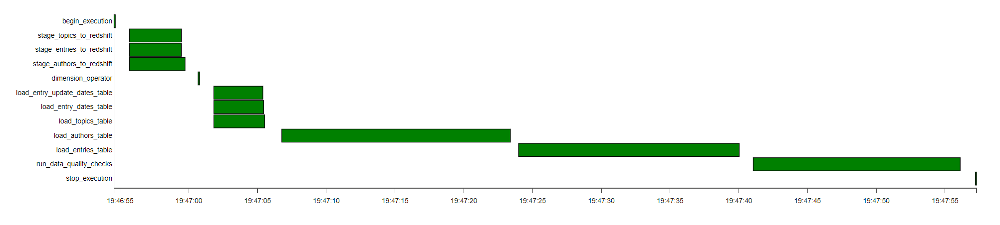

There is also one more dag that parses new data periodically. At the end of each day (local time) the site resets the homepage and archives all the entries of that day. So I decided to write a dag to get today's topics and entries, preprocess them and save it to the local storage. Soon, I will integrate this dag with the other one.

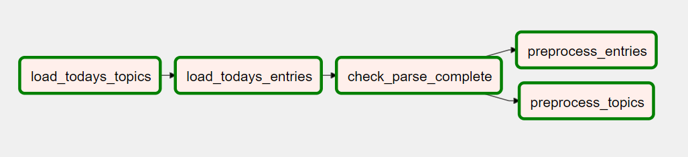

- Since the crawling codebase was in my local environment and docker airflow didn't play well with the setup, I decided to bridge docker to the local network and have them talk over the API. For exposing steps in the dag I used FastAPI.

This is the screenshot authors' table in the redshift.

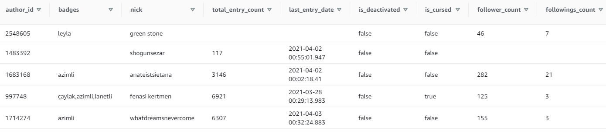

# SparkNLP

- I also spend some time with spark nlp `/scripts/5_spark/` 
- Although it is a state-of-the-art tool, and I want to create custom pipelines with it, because of the deadline of this and other projects I decided to keep it out of the scope.  

# Tools Used

- scrapy and requests for data gathering
- mongodb to save raw data and iterate on not a fixed model
- postgresql and pyadmin for local database and tests
- docker for spark, airflow, and local db
- airflow for scheduling and ETL pipeline
- redshift to store data on warehouse 
- fastapi for exposing crawl/parse/preprocess tasks
- pydantic and datamodel-codegen for model generation

# Questions

- Data should be updated daily and at the end of the day (11 pm- 12 pm) since it is archived each day by the site
- if data is already big and requires a cluster to process if it increases by 100x going with EMR cluster like this makes sense. The problem is the content in the entry table. If this wasn't for analytical purposes (if I was going to serve the data to end-users) I would probably go with a distributed NoSQL database.
  - I couldn't find it now but somewhere I read that the site uses Microsoft SQL database in production. I wonder how they do it.
- If the database needed to be accessed by 100+ people, we could move it all to Spark and use processed tables or we could scale the clusters.

# How to Run the project

## Setup Environment 
install [conda](https://conda.io/projects/conda/en/latest/user-guide/install/download.html)  
create and activate conda environment
- conda env create -f .\temp\capstone_environment.yml
- conda activate capstone_hkn

## Setup Airflow
install [docker](https://www.docker.com/)  
- docker-compose -f .\docker\airflow-compose.yaml up -d
- http://localhost:8080/
- login with airflow:airflow
- add `redshift` and `aws_credentials`

## Setup Redshift
- Create cluster and input password and host into `/scripts/6_redshift/redshift.ipynb` file
- run drop and create table queries

## Prepare Data
- Upload 3 sample staging files to s3 `/data/eksi_preprocessed/sample_.*.json`
- change the bucket, region and file names inside the dag `/airflow/dags/load_data_dag.py`

## Run 
- Start the `load_data_dag` dag from the airflow interface

## Extra
Running the second dag requires a bit more configuration and not essential to the capstone project
- in seperate terminal go to `/apis/eksi/` and run `uvicorn main:app --host 0.0.0.0 --reload`
  - this will use port 8000 and listen on all interfaces
- I am using `portainer` for docker configurations, there add airflow worker (`docker_airflow-worker_1`) to bridge network.
- In `/airflow/dags/data_gathering_dag.py` change the `CRAWLER_API_ENDPOINT` to your local host bridge network address (in windows -> ipconfig -> WSL vEthernet)
- with this docker will be able to access the api in `0.0.0.0:8000`

# Future Tasks

- I would like to enrich the data with additional datasets I have collected
- Add logic to get missing authors
- Go over incomplete topics (3m topics)
- Use SparkNLP
  - Get Turkish model from huggingface and create a pipeline with it
  - User NER to create new tables
- Add email support for failed apache tasks
- strongly type data models and import to spark
