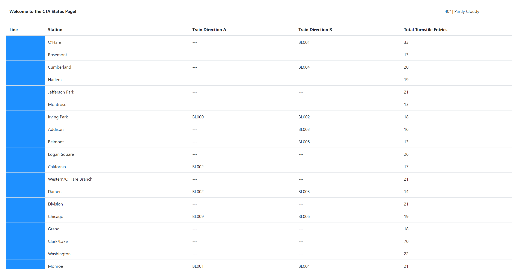
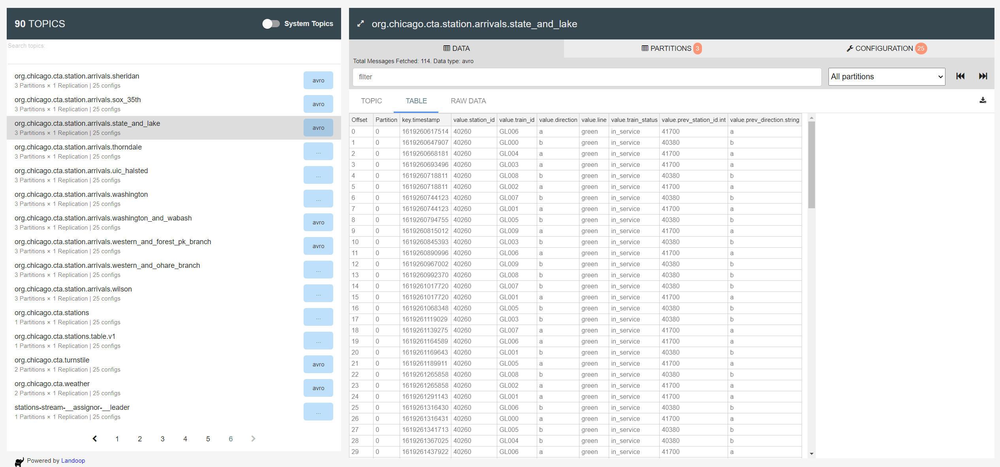

# How to run

- install anaconda
- create environment
  - `conda env create -f environment.yml`
- activate environment
  - `conda activate ds`
- start docker containers
  - `docker-compose up -d`
- wait until ui is up 
  - `http://localhost:8085/`

---

in 4 split terminals, activate conda environment and run these commands in order one after the other

- start producers
  - `cd producers`
  - `python simulation.py`
- start faust
  - `cd consumers`
  - `faust -A faust_stream worker -l info `
- start ksql
  - `cd consumers`
  - `python ksql.py`
- start consumer ui
  - `cd consumers`
  - `python server.py`
- open UI
  - `http://localhost:8888/`

# Results

